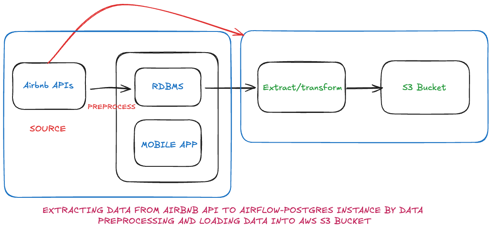
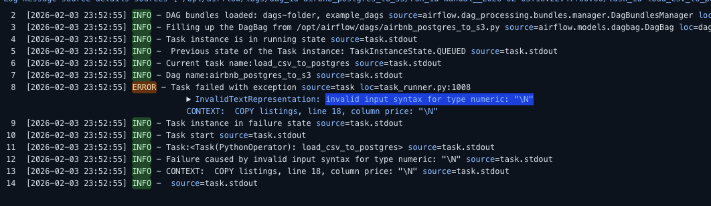
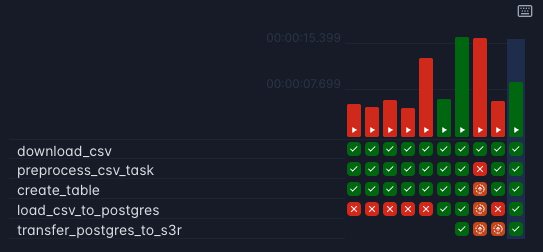
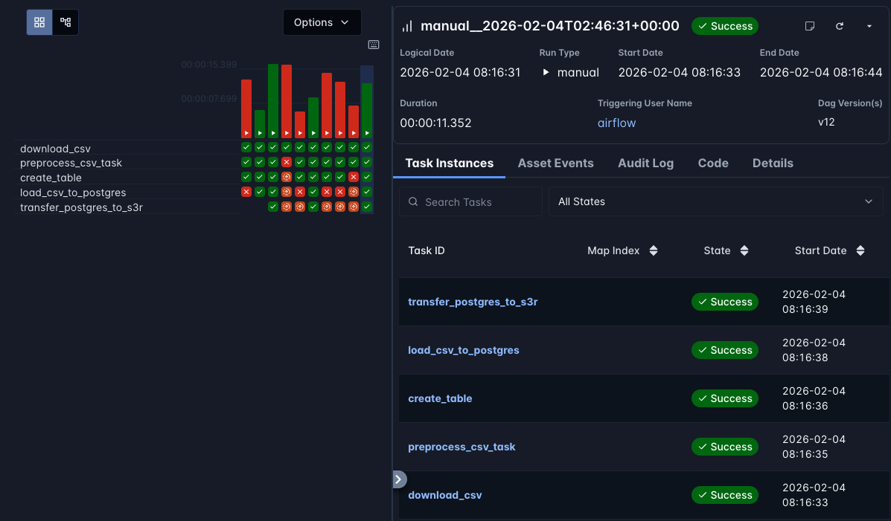
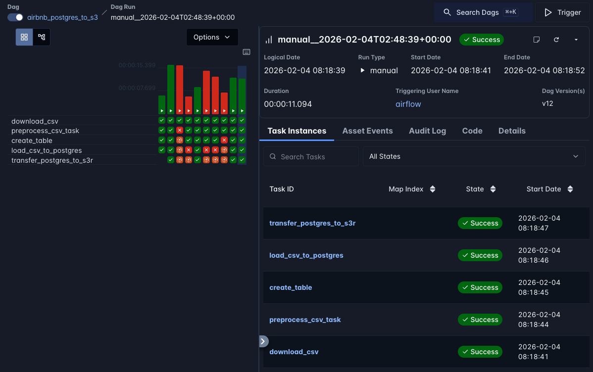
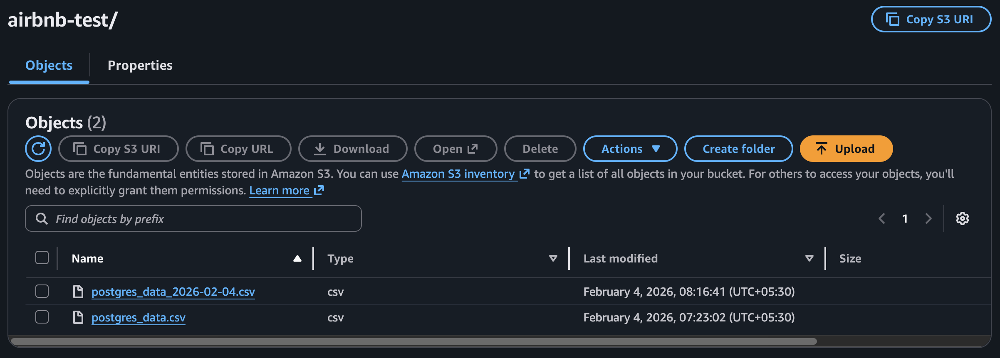

# Apache Airflow – Postgres to S3 Data Pipeline

This repository contains a **production-style Apache Airflow pipeline** that ingests Airbnb listing data into **PostgreSQL** and exports the processed data to **AWS S3** using a **custom Airflow operator**.

The goal of this project is to demonstrate **real-world data engineering practices**, focusing on correctness, idempotency, and system behavior under failure — not just a happy-path tutorial.

---

## 🔧 Tech Stack

- **Apache Airflow 3.x** - Workflow orchestration
- **PostgreSQL** - Data storage and processing
- **AWS S3** - Cloud data lake storage
- **Python 3.12** - Core programming language
- **Pandas** - Data preprocessing and manipulation
- **Docker** - Containerized deployment
- **SQL** - Data querying and transformation

---

## 🏗️ Architecture Overview

### Pipeline Flow

```
Airbnb CSV Files (Inside Airbnb API)
          ↓
    Download CSV
          ↓
  Preprocess Data (Pandas)
          ↓
 Create PostgreSQL Table
          ↓
  Bulk Load (COPY command)
          ↓
Custom Operator (PostgresToS3Operator)
          ↓
   AWS S3 Storage
```

### Data Flow Diagram

```
┌─────────────────────────────────────────────────────────────┐
│                    Inside Airbnb API                        │
│  https://data.insideairbnb.com/.../listings.csv             │
└──────────────────────┬──────────────────────────────────────┘
                       │
                       ▼
         ┌─────────────────────────┐
         │   download_csv Task     │
         │  (PythonOperator)       │
         │  Downloads 11 snapshots │
         └───────────┬─────────────┘
                     │
                     ▼
         ┌─────────────────────────┐
         │  preprocess_csv Task    │
         │  (PythonOperator)       │
         │  - Handle NULLs         │
         │  - Format for COPY      │
         └───────────┬─────────────┘
                     │
                     ▼
         ┌─────────────────────────┐
         │   create_table Task     │
         │ (SQLExecuteQueryOperator)│
         │  Creates listings table │
         └───────────┬─────────────┘
                     │
                     ▼
         ┌─────────────────────────┐
         │ load_csv_to_postgres    │
         │  (PythonOperator)       │
         │  - DELETE old data      │
         │  - COPY bulk load       │
         └───────────┬─────────────┘
                     │
                     ▼
         ┌─────────────────────────┐
         │ transfer_postgres_to_s3 │
         │ (PostgresToS3Operator)  │
         │  Custom operator        │
         └───────────┬─────────────┘
                     │
                     ▼
         ┌─────────────────────────┐
         │       AWS S3            │
         │  s3://aws-airbnb-       │
         │  s3bucket/airbnb-test/  │
         └─────────────────────────┘
```

### Pipeline Architecture


---

## 📁 Project Structure

```
airflow-postgres-s3-pipeline/
│
├── dags/
│   └── airbnb_postgres_to_s3.py          # Main DAG definition
│
├── plugins/
│   └── custom_operator/
│       └── postgres_to_s3_operator.py     # Custom operator
│
├── screenshots/
│   ├── full_architecture.png
│   ├── Schema Errors.png
│   ├── Partial Success.png
│   ├── First Success.png
│   ├── Complete Success.png
│   └── AWS S3.png
│
├── requirements.txt
├── docker-compose.yml
└── README.md
```

---

## 📌 Project Motivation

While building this pipeline, several real-world issues surfaced that are often skipped in tutorials:

- **CSV NULL values breaking Postgres `COPY`**
- **`invalid input syntax for type numeric`** errors
- **Postgres `DEFAULT` values being ignored during bulk loads**
- **Duplicate data on DAG re-runs** causing data corruption
- **Pipelines succeeding while the data itself was incorrect**
- **Lack of reusable abstractions** for exporting Postgres data to S3

This project documents how each of these problems was **identified and resolved incrementally**, showcasing real debugging and problem-solving in data engineering.

---

## 🚨 Key Challenges Encountered

### 1. CSV NULL Handling 🔴

**Problem:**  
Postgres `COPY` expects `\N` for NULL values. Empty strings and improper quoting caused numeric and date parsing errors.

**Error Message:**
```
ERROR: invalid input syntax for type numeric: ""
CONTEXT: COPY listings, line 42, column price: ""
```

**Solution:**
```python
# In preprocess_csv():
df.to_csv(output_file, index=False, na_rep='\\N', quoting=csv.QUOTE_MINIMAL)
```

This ensures:
- All NULL/NaN values are written as `\N`
- Postgres can properly parse numeric and date fields
- No empty string errors during COPY



---

### 2. Postgres `COPY` vs `INSERT` ⚠️

**Problem:**  
Unlike `INSERT`, `COPY` does **not** apply column defaults unless explicitly handled.

**Example:**
```sql
-- This DEFAULT is IGNORED during COPY
CREATE TABLE listings (
    id SERIAL PRIMARY KEY,
    load_date DATE DEFAULT CURRENT_DATE  -- ❌ Won't be set by COPY
);
```

**Solution:**  
Explicitly exclude columns with defaults from the COPY statement:

```python
cur.copy_expert(
    r"""
    COPY listings (
        id, name, host_id, host_name,
        -- ... other columns ...
        -- ❌ NO load_date or processed_at here
    )
    FROM STDIN
    WITH (FORMAT CSV, HEADER TRUE, NULL '\N');
    """, 
    f
)
```

The database will then apply the DEFAULT values automatically.

---

### 3. Idempotency & Safe Re-runs ♻️

**Problem:**  
Re-running Airflow DAGs without safeguards can silently duplicate or corrupt data.

**Solution:**  
Each DAG run deletes previously ingested data for the current batch before loading new data:

```python
def load_csv_to_postgres():
    # Delete today's data before re-loading
    cur.execute("DELETE FROM listings WHERE load_date = CURRENT_DATE;")
    conn.commit()
    
    # Then bulk load fresh data
    for date in listing_dates:
        cur.copy_expert(...)
```

This ensures:
- ✅ Re-runs are safe
- ✅ No duplicate data
- ✅ Each batch is independently trackable

---

### 4. Separation of Concerns 🧩

**Problem:**  
Mixing ingestion logic with export logic creates messy, non-reusable code.

**Solution:**  
Created a **custom reusable Airflow operator** (`PostgresToS3Operator`) that:
- Uses `PostgresHook` for database queries
- Uses `S3Hook` for S3 uploads
- Supports Airflow templating (`{{ ds }}`)
- Can be reused across multiple DAGs

**Operator Usage:**
```python
transfer_postgres_to_s3 = PostgresToS3Operator(
    task_id="transfer_postgres_to_s3",
    postgres_conn_id="airbnb_postgres",
    query="SELECT * FROM listings WHERE load_date = CURRENT_DATE",
    s3_bucket="aws-airbnb-s3bucket",
    s3_conn_id="aws_s3_airbnb",
    s3_key="airbnb-test/postgres_data_{{ ds }}.csv"  # Templated!
)
```

---

## 🧠 Key Design Decisions

### ✅ Idempotent Batch Loads

Each DAG run represents a **single batch** with a unique `load_date`. Before loading, any existing data for that batch is deleted:

```python
DELETE FROM listings WHERE load_date = CURRENT_DATE;
```

This ensures:
- Safe re-runs
- No duplicate data
- Traceable data lineage

---

### ✅ Explicit Column Mapping

All bulk loads use **explicit column lists** to avoid:
- Schema drift
- Default-value surprises
- Silent data corruption

```python
COPY listings (
    id, name, host_id, host_name,
    neighbourhood_group, neighbourhood,
    latitude, longitude, room_type,
    price, minimum_nights, number_of_reviews,
    last_review, reviews_per_month,
    calculated_host_listings_count,
    availability_365, number_of_reviews_ltm,
    license
    -- ❌ NO load_date or processed_at (uses DEFAULT)
)
```

---

### ✅ Custom Airflow Operator

A reusable `PostgresToS3Operator` was implemented:

**Features:**
- Inherits from `BaseOperator`
- Uses `PostgresHook` for database connections
- Uses `S3Hook` for S3 uploads
- Supports templated fields (`query`, `s3_key`)
- Memory-efficient (uses `io.StringIO` buffer)

**Implementation Highlights:**

```python
class PostgresToS3Operator(BaseOperator):
    template_fields: Sequence[str] = ("query", "s3_key")
    
    def execute(self, context: Context):
        # Fetch data from Postgres
        postgres_hook = PostgresHook(postgres_conn_id=self.postgres_conn_id)
        rows = postgres_hook.get_records(self.query)
        
        # Write to in-memory CSV
        data_buffer = io.StringIO()
        csv_writer = csv.writer(data_buffer)
        csv_writer.writerows(rows)
        
        # Upload to S3
        s3_hook = S3Hook(aws_conn_id=self.s3_conn_id)
        s3_hook.load_string(
            string_data=data_buffer.getvalue(),
            bucket_name=self.s3_bucket,
            key=self.s3_key
        )
```

This keeps the DAG clean and the export logic reusable.

---

## 📦 DAG Task Overview

### Task Dependency Graph

```
download_csv
     ↓
preprocess_csv
     ↓
create_table
     ↓
load_csv_to_postgres
     ↓
transfer_postgres_to_s3
```

---

### Task Details

#### 1️⃣ **download_csv** (PythonOperator)

Downloads Airbnb listing CSV files from Inside Airbnb for **11 snapshot dates**.

```python
listing_dates = [
    "2025-11-07", "2025-10-05", "2025-09-06",
    "2025-08-04", "2025-07-04", "2025-06-09",
    "2025-05-02", "2025-04-03", "2025-03-02",
    "2025-02-06", "2025-01-05"
]

def download_csv():
    url_template = "https://data.insideairbnb.com/united-states/ny/albany/{date}/visualisations/listings.csv"
    
    for date in listing_dates:
        url = url_template.format(date=date)
        response = requests.get(url)
        
        if response.status_code == 200:
            with open(f"/tmp/airbnbdata/listing-{date}.csv", "wb") as f:
                f.write(response.content)
        else:
            print(f"Failed to download {url}")
```

**Output:** 11 CSV files in `/tmp/airbnbdata/`

---

#### 2️⃣ **preprocess_csv** (PythonOperator)

Cleans and prepares the data for Postgres `COPY` ingestion.

```python
def preprocess_csv():
    for date in listing_dates:
        input_file = f"/tmp/airbnbdata/listing-{date}.csv"
        output_file = f"/tmp/airbnbdata/listing-{date}-processed.csv"
        
        df = pd.read_csv(input_file)
        
        # Key: Write NULLs as \N for Postgres COPY
        df.to_csv(
            output_file,
            index=False,
            na_rep='\\N',           # NULL handling
            quoting=csv.QUOTE_MINIMAL
        )
```

**Key Processing:**
- Reads raw CSV files
- Converts NaN/None to `\N` (Postgres NULL)
- Saves processed files for COPY

**Output:** 11 processed CSV files ready for Postgres

---

#### 3️⃣ **create_table** (SQLExecuteQueryOperator)

Creates the PostgreSQL table with proper schema and indexes.

```sql
DROP TABLE IF EXISTS listings;

CREATE TABLE IF NOT EXISTS listings (
    id BIGINT,
    name TEXT,
    host_id INTEGER,
    host_name VARCHAR(255),
    neighbourhood_group VARCHAR(255),
    neighbourhood VARCHAR(255),
    latitude DECIMAL(10, 7),
    longitude DECIMAL(10, 7),
    room_type VARCHAR(50),
    price NUMERIC(10,2),
    minimum_nights INTEGER,
    number_of_reviews INTEGER,
    last_review DATE,
    reviews_per_month NUMERIC(10, 2),
    calculated_host_listings_count INTEGER,
    availability_365 INTEGER,
    number_of_reviews_ltm INTEGER,
    license VARCHAR(255),
    load_date DATE DEFAULT CURRENT_DATE,
    processed_at TIMESTAMP DEFAULT CURRENT_TIMESTAMP
);
```

**Key Points:**
- `load_date` and `processed_at` have DEFAULT values
- These columns are **excluded** from COPY to use defaults
- DROP TABLE IF EXISTS ensures clean slate

---

#### 4️⃣ **load_csv_to_postgres** (PythonOperator)

Bulk loads data using Postgres `COPY` for high performance.

```python
def load_csv_to_postgres():
    hook = PostgresHook(postgres_conn_id="airbnb_postgres")
    conn = hook.get_conn()
    cur = conn.cursor()
    
    # Idempotency: Delete today's data first
    cur.execute("DELETE FROM listings WHERE load_date = CURRENT_DATE;")
    conn.commit()
    
    # Bulk load all snapshots
    for date in listing_dates:
        processed_file = f"/tmp/airbnbdata/listing-{date}-processed.csv"
        
        with open(processed_file, 'r') as f:
            cur.copy_expert(
                r"""
                COPY listings (
                    id, name, host_id, host_name,
                    neighbourhood_group, neighbourhood,
                    latitude, longitude, room_type, price,
                    minimum_nights, number_of_reviews,
                    last_review, reviews_per_month,
                    calculated_host_listings_count,
                    availability_365, number_of_reviews_ltm,
                    license
                )
                FROM STDIN
                WITH (
                    FORMAT CSV,
                    HEADER TRUE,
                    NULL '\N'
                );
                """, 
                f
            )
    
    conn.commit()
    cur.close()
    conn.close()
```

**Key Features:**
- **Idempotent:** Deletes existing data before loading
- **Fast:** Uses `COPY` (much faster than INSERT)
- **Explicit columns:** Only loads data columns, not metadata
- **NULL handling:** `NULL '\N'` matches preprocessing

---

#### 5️⃣ **transfer_postgres_to_s3** (PostgresToS3Operator)

Exports data from Postgres to AWS S3 using a custom operator.

```python
transfer_postgres_to_s3 = PostgresToS3Operator(
    task_id="transfer_postgres_to_s3",
    postgres_conn_id="airbnb_postgres",
    query="SELECT * FROM listings WHERE load_date = CURRENT_DATE",
    s3_bucket="aws-airbnb-s3bucket",
    s3_conn_id="aws_s3_airbnb",
    s3_key="airbnb-test/postgres_data_{{ ds }}.csv",  # Uses Airflow execution date
    dag=dag
)
```

**Features:**
- Templated `s3_key` with `{{ ds }}` (execution date)
- Only exports today's loaded data
- Memory-efficient CSV generation
- Automatic S3 upload

**S3 Output Path Example:**
```
s3://aws-airbnb-s3bucket/airbnb-test/postgres_data_2025-02-03.csv
```

---

## 🛠️ Custom Operator Implementation

### PostgresToS3Operator

**File:** `plugins/custom_operator/postgres_to_s3_operator.py`

```python
import csv
import io
from typing import Sequence
from airflow.models import BaseOperator
from airflow.providers.postgres.hooks.postgres import PostgresHook
from airflow.providers.amazon.aws.hooks.s3 import S3Hook
from airflow.utils.context import Context


class PostgresToS3Operator(BaseOperator):
    """
    Executes a SQL query on Postgres and uploads the result as CSV to S3.
    
    :param postgres_conn_id: Postgres connection ID
    :param query: SQL query to execute
    :param s3_conn_id: AWS connection ID
    :param s3_bucket: S3 bucket name
    :param s3_key: S3 object key (supports templating)
    """
    
    template_fields: Sequence[str] = ("query", "s3_key")
    
    def __init__(
        self,
        *,
        postgres_conn_id: str,
        query: str,
        s3_conn_id: str,
        s3_bucket: str,
        s3_key: str,
        **kwargs
    ):
        super().__init__(**kwargs)
        self.postgres_conn_id = postgres_conn_id
        self.query = query
        self.s3_conn_id = s3_conn_id
        self.s3_bucket = s3_bucket
        self.s3_key = s3_key
    
    def execute(self, context: Context):
        self.log.info("Running Postgres query")
        
        # Initialize hooks
        postgres_hook = PostgresHook(postgres_conn_id=self.postgres_conn_id)
        s3_hook = S3Hook(aws_conn_id=self.s3_conn_id)
        
        # Execute query and fetch results
        with postgres_hook.get_conn() as conn:
            with conn.cursor() as cursor:
                cursor.execute(self.query)
                rows = cursor.fetchall()
                headers = [col[0] for col in cursor.description]
        
        self.log.info("Fetched %d rows from Postgres", len(rows))
        
        # Write to in-memory CSV buffer
        data_buffer = io.StringIO()
        csv_writer = csv.writer(
            data_buffer,
            quoting=csv.QUOTE_MINIMAL,
            lineterminator="\n"
        )
        
        csv_writer.writerow(headers)
        csv_writer.writerows(rows)
        
        # Upload to S3
        s3_hook.load_string(
            string_data=data_buffer.getvalue(),
            bucket_name=self.s3_bucket,
            key=self.s3_key,
            replace=True
        )
        
        self.log.info(
            "Uploaded %d rows to s3://%s/%s",
            len(rows),
            self.s3_bucket,
            self.s3_key
        )
```

**Why This Design?**
- ✅ **Reusable** - Can be used in any DAG
- ✅ **Templated** - Supports Airflow macros (`{{ ds }}`, `{{ execution_date }}`)
- ✅ **Memory-efficient** - Uses `io.StringIO` instead of temp files
- ✅ **Clean separation** - Keeps DAG code simple
- ✅ **Proper logging** - Uses Airflow's logging system

---

## 🔧 Setup Instructions

### Prerequisites

- Docker & Docker Compose
- AWS Account with S3 access
- PostgreSQL database

---

### 1. Clone the Repository

```bash
git clone https://github.com/yourusername/airflow-postgres-s3-pipeline.git
cd airflow-postgres-s3-pipeline
```

---

### 2. Set Up Environment Variables

Create a `.env` file:

```bash
# Airflow
AIRFLOW_UID=50000
AIRFLOW__CORE__EXECUTOR=LocalExecutor
AIRFLOW__CORE__LOAD_EXAMPLES=False

# Postgres
POSTGRES_USER=airflow
POSTGRES_PASSWORD=airflow
POSTGRES_DB=airflow

# AWS (Optional - can also use Airflow Connections)
AWS_ACCESS_KEY_ID=your_access_key
AWS_SECRET_ACCESS_KEY=your_secret_key
AWS_DEFAULT_REGION=us-east-1
```

---

### 3. Start Airflow

```bash
# Initialize Airflow database
docker-compose up airflow-init

# Start Airflow services
docker-compose up -d
```

Access Airflow UI: http://localhost:8080
- Username: `airflow`
- Password: `airflow`

---

### 4. Configure Airflow Connections

#### Postgres Connection

1. Go to **Admin → Connections**
2. Click **+** to add new connection
3. Fill in:
   - **Connection Id:** `airbnb_postgres`
   - **Connection Type:** `Postgres`
   - **Host:** `postgres` (or your host)
   - **Schema:** `airflow`
   - **Login:** `airflow`
   - **Password:** `airflow`
   - **Port:** `5432`

#### AWS S3 Connection

1. Go to **Admin → Connections**
2. Click **+** to add new connection
3. Fill in:
   - **Connection Id:** `aws_s3_airbnb`
   - **Connection Type:** `Amazon Web Services`
   - **AWS Access Key ID:** `your_access_key`
   - **AWS Secret Access Key:** `your_secret_key`
   - **Region Name:** `us-east-1`

---

### 5. Create S3 Bucket

```bash
# Using AWS CLI
aws s3 mb s3://aws-airbnb-s3bucket --region us-east-1

# Verify
aws s3 ls
```

**Note:** S3 bucket names must be:
- Lowercase only
- 3-63 characters
- No underscores or spaces
- Globally unique

---

### 6. Install Python Dependencies

If running locally (not Docker):

```bash
pip install -r requirements.txt
```

**requirements.txt:**
```
apache-airflow==3.1.5
apache-airflow-providers-postgres
apache-airflow-providers-amazon
pandas
requests
numpy
```

---

### 7. Run the DAG

1. Go to Airflow UI
2. Enable the `airbnb_postgres_to_s3` DAG
3. Click **Trigger DAG** (play button)
4. Monitor task execution in the Graph view

---

## 📸 Screenshots

### Schema Errors (Before Fix)


### Partial Success (During Debugging)


### First Success


### Complete Success


### AWS S3 Output


---

## 🚀 What This Project Demonstrates

### Technical Skills

- ✅ **Production-style Airflow pipeline design**
- ✅ **Safe and idempotent batch ingestion**
- ✅ **Deep understanding of Postgres `COPY` semantics**
- ✅ **Custom Airflow operator development**
- ✅ **Debugging and fixing real data pipeline failures**
- ✅ **Clean separation between ingestion and export layers**
- ✅ **AWS S3 integration**
- ✅ **Proper NULL handling in CSVs**
- ✅ **Memory-efficient data processing**

### Engineering Practices

- 🔧 **Idempotency** - Safe re-runs without data corruption
- 🔧 **Explicit schema management** - No reliance on implicit defaults
- 🔧 **Separation of concerns** - Reusable operators
- 🔧 **Proper error handling** - Graceful failures
- 🔧 **Clean code** - Readable, maintainable DAGs
- 🔧 **Production-ready** - Real-world problem solving

---

## 🔮 Future Improvements

### Short-term

- [ ] Replace hardcoded `listing_dates` with Airflow `logical_date`
- [ ] Enable `catchup=True` for native backfills
- [ ] Add data quality checks (Great Expectations)
- [ ] Implement retry logic with exponential backoff

### Medium-term

- [ ] Partition S3 outputs by date (`year=2025/month=02/day=03/`)
- [ ] Convert CSV outputs to Parquet for better compression
- [ ] Add incremental loading (track last_modified)
- [ ] Implement SCD Type 2 for historical tracking

### Long-term

- [ ] Migrate to Apache Iceberg/Delta Lake
- [ ] Add data lineage tracking (OpenLineage)
- [ ] Implement CI/CD pipeline for DAG testing
- [ ] Add monitoring and alerting (Prometheus + Grafana)
- [ ] Create dbt models for transformations

---

## 📚 Lessons Learned

### 1. Postgres COPY is Powerful but Strict

- NULL handling must be explicit (`\N`)
- Default values are ignored
- Column order matters
- Error messages can be cryptic

### 2. Idempotency is Non-Negotiable

- Always design for re-runs
- Use `DELETE` + `INSERT` pattern for batch loads
- Track data lineage with metadata columns

### 3. Custom Operators Add Value

- Reduces code duplication
- Encapsulates complex logic
- Makes DAGs more readable
- Easier to test and maintain

### 4. Real-World Data is Messy

- CSVs have encoding issues
- APIs change formats
- NULL values appear in unexpected places
- Always validate and clean data

---

## 🤝 Contributing

Contributions are welcome! Please feel free to submit a Pull Request.

### Areas for Contribution

- Additional data sources
- More sophisticated transformations
- Performance optimizations
- Documentation improvements
- Test coverage

---

## 📄 License

This project is licensed under the MIT License - see the LICENSE file for details.

---

## 🔗 Connect with Me

**Sumanth Malipeddi**  
- 💼 LinkedIn: [https://www.linkedin.com/in/sumanth-malipeddi/](https://www.linkedin.com/in/sumanth-malipeddi/)
- 📧 Email: Open to discussions on data engineering, Apache Airflow, and ETL design
- 🐙 GitHub: [Your GitHub Profile]

---

## 🙏 Acknowledgments

- **Inside Airbnb** - For providing open data
- **Apache Airflow Community** - For excellent documentation
- **Stack Overflow** - For debugging help during the real challenges

---

## 📝 Project History

This project was built as part of **self-directed learning and hands-on experimentation** with Apache Airflow and data engineering.

The focus of this project is **learning through real-world failure scenarios** and **production-style fixes**, not just creating a working pipeline.

Each challenge encountered represents a real problem that junior to mid-level data engineers face in production environments.

---

**Built with ❤️ and lots of debugging**

*Last Updated: February 2025*
